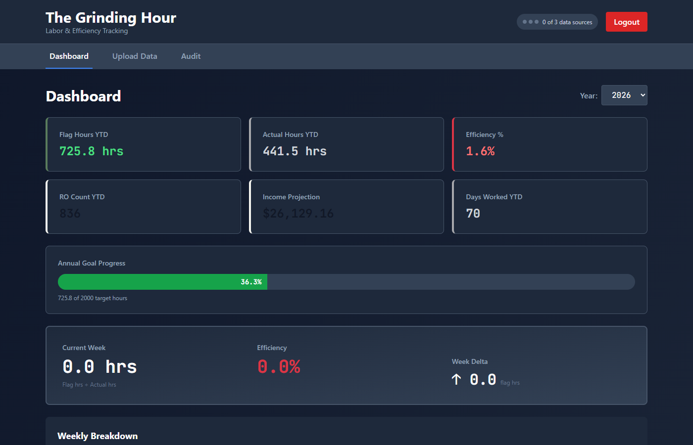

# The Grinding Hour — Labor Efficiency Tracker

Labor and efficiency tracking dashboard for Kia Certified Master Technicians. Consolidates Tekion Tech Reports, RO Lists, and manual Labor Logs into a single source of truth with discrepancy auditing.

## Stack

| Layer | Tech |
|---|---|
| Backend | FastAPI + Python 3.11 |
| Frontend | Vite + React + TypeScript + Tailwind CSS |
| Database | SQLite + SQLAlchemy ORM |
| Auth | JWT (8-hour tokens) |

## Quick Start

1. **Backend:**
   ```powershell
   cd backend
   python -m venv .venv
   .venv\Scripts\Activate.ps1
   pip install -r requirements.txt
   cp .env.example .env
   python main.py
   ```

2. **Frontend** (new terminal):
   ```powershell
   cd frontend
   npm install
   npm run dev
   ```

3. Open `http://localhost:5174` and log in

## Configuration

Copy `.env.example` to `.env`:

```
GRINDING_HOUR_PASSWORD=your-password
SECRET_KEY=your-random-secret-key
```

## Data Import Workflow

1. Log in at `http://localhost:5174`
2. Go to **Upload** tab
3. Import in order:
   - **Tech Report** (xlsx) — Tekion technician report
   - **RO List** (xlsx) — Tekion RO list
   - **Labor Log** (xlsx) — Manual tracking sheet
4. **Dashboard** → Tekion-verified stats (flag hours, efficiency %, income projection)
5. **Audit** → Tekion vs manual hours by date

## Ports

| Service | Port |
|---------|------|
| Backend | 8001 |
| Frontend | 5174 |

## Screenshot



## License

MIT
